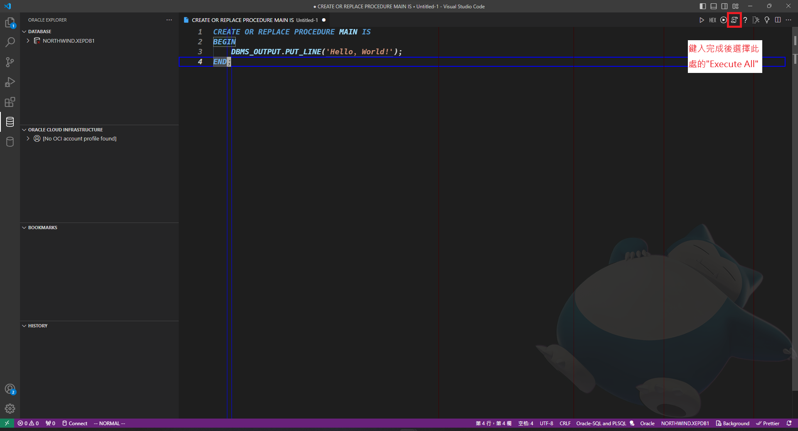

# `Hello World`

大多數讀者在最初學第一個程式語言時，不意外地都會是以**印出`Hello World!`**作為開頭，`PL/SQL`自然也不例外。

## `Hello World`的起源

根據維基百科的[`Hello World`](https://zh.wikipedia.org/zh-tw/Hello_World)所述，最初只是用來演示外部變範例程式，然而時至今日此方法用來驗證程式的最初安裝與測試是否正確可運行。

## `PL/SQL`的仿終端機輸出

1.


2.</br>輸入以下程式碼建立仿 MAIN

```SQL
CREATE OR REPLACE PROCEDURE MAIN IS
BEGIN
    DBMS_OUTPUT.PUT_LINE('Hello, World!');
END;
```



3.</br> 4.</br> 5.</br> 6.</br> 7.</br>

## 動作說明

相信到此讀者肯定有許多疑問：

1. 為什麼要用`CREATE OR REPLACE PROCEDURE MAIN IS ...`這句`SQL`執行(流程 2)？
2. 執行`SQL`後為什麼又要從資料庫內再開啟一份相同的`SQL`內容的檔案(流程 4)?
3. 開啟的`SQL`為什麼要先下斷點再重新執行`Compile Debug`(流程 5)?
4. `Compile Debug`後為什麼要用`Run Debug`(流程 6 與 7)?

這邊來一一說明為何進行這麼繁瑣的動作：

1. <font color=green>問:</font>使用`CREATE OR REPLACE PROCEDURE MAIN IS ...`這句`SQL`執行?</br>
   <font color=blue>答：</font>主要是因為`Oracle`內沒有任何一般程式語言的主要進入點，以`C/C++`為例，程式在運行時會有一個進入點`main`，然而`Oracle`並沒有規定必須從何處作為進入點，此方式與`Python`有點類似，任何`方法(函式)`都可以是<u>程式的進入點</u>，此處為了讓讀者有較明確的方向，因此做出一個`仿MAIN`程式進入點。
2. <font color=green>問：</font>執行`SQL`後為什麼又要從資料庫內再開啟一份相同的`SQL`內容的檔案?</br>
   <font color=blue>答：</font>原本有`SQL`內容的程式碼檔案，並不屬於`偵錯追蹤`的範圍，雖然資料庫內已經有紀錄相同內容的`仿MAIN`，但`程式碼檔案`所在的範圍並不是於`Oracle`內，因此開啟相同`SQL`內容的檔案，表示基於`Oracle`監控的範圍所開啟檔案，在`Oracle`的監控範圍內開啟的檔案才能夠進行`偵錯`。
3. <font color=green>問：</font>開啟的`SQL`為什麼要先下斷點再重新執行`Compile Debug`?</br>
   <font color=blue>答：</font>通常在執行`SQL`都是建立在不需要`Debug`的`語句`，若要進行`可Debug`的功能需要再次使用`Compile Debug`，將當前的`PROCEDURE`再次編譯成`可Debug`的編譯。而`設定中斷點`的部分如同`其他的程式語言`，不設置中斷點在進行運作時是不會停下來的。若進行的段落是不需要追蹤的，可以將中斷點設置在需要追蹤的部分。
4. <font color=green>問：</font>`Compile Debug`後為什麼要用`Run Debug`?</br>
   <font color=blue>答：</font>表示針對當前`PROCEDURE`進行`偵錯`動作，若選擇為非`Run Debug`，就算內部有下中斷點，扔舊會被忽略停頓。

上述繁瑣的動作是針對`PL/SQL`程式碼進行`偵錯`的流程，若不考慮`版本控制`的編寫前提且只針對當前的`PROCEDURE`進行編寫，那麼是否要再次進行`流程 2`的動作就可有可無，然而依照筆者的過往經歷，將`編寫`與`偵錯`放在兩個檔案的好處是，明確的確定當下的動作是屬於`編寫`還是`偵錯`。

除了上面所提供的方式之外讀者亦可嘗試將`DBMS_OUTPUT.PUT_LINE`更換為`DBMS_OUTPUT.PUT`，兩者主要差別是是否在輸出後自動換行，若不進行自動換行的動作，則訊息並不會被顯示出來，直到有執行`DBMS_OUTPUT.PUT_LINE`為止。
