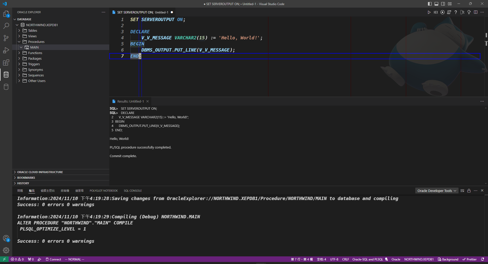
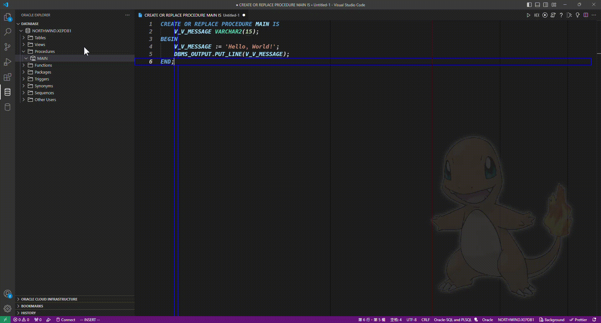

# 變數

## 什麼是變數

&emsp;&emsp;依照維基百科的[變數 (程式設計)](<https://zh.wikipedia.org/zh-tw/%E5%8F%98%E9%87%8F_(%E7%A8%8B%E5%BA%8F%E8%AE%BE%E8%AE%A1)>)

> 變數是指一個抽象的儲存位址，它含有了被稱為一個值的某種已知或未知的資訊量，並且配對了關聯的符號名稱

&emsp;&emsp;若不使用變數作為資料數據的臨時存放項目，那麼程式指能夠依照預先寫在程式碼內的數據做資料處理。相信這個程式肯定不會有人用，因為他能做的事情就被限定了。那麼為了要能夠不限制程式不只依照一個數據做單一動作，用來裝數據的項目就是變數。</br>
&emsp;&emsp;變數可以持有的數據類型可以有很多種，在`弱型別`語言內變數的類型可以不用固定式單一類型，而`強型別`的語言變數在宣告的當下只能夠是單一類型。</br>
&emsp;&emsp;`PL/SQL`是基於`RDBMS`的`SQL`所擴展出來的程式語言，因此`PL/SQL`是屬於`強型別`的程式語言。變數在宣告時就<u>必須</u>指定數據類型，且改變持有的數據時也必須是<u>相同</u>的數據類型。

## 變數的宣告方式

若讀者當下所使用的方式不是基於`方法`的使用，則宣告方式會與基於`方法`的使用有所不同(差異不大)。

### 結構

```SQL
    {變數名稱} {變數類型} [:= {初始值}];
```

**賦值的符號是用`:=`作為賦值，此為`Pascal體系的特有用法`**

---

### 非基於`方法`的使用

```SQL
DECLARE
    V_V_MESSAGE VARCHAR2(15) := 'Hello, World!';
BEGIN
    DBMS_OUTPUT.PUT_LINE(V_V_MESSAGE);
END;

/*
 *************************************************
 * 輸出結果：
 * SQL>   SET SERVEROUTPUT ON;
 * SQL>   DECLARE
 *  2      V_V_MESSAGE VARCHAR2(15) := 'Hello, World!';
 *   3  BEGIN
 *   4      DBMS_OUTPUT.PUT_LINE(V_V_MESSAGE);
 *   5  END;
 *
 * Hello, World!
 *
 * PL/SQL procedure successfully completed.
 *
 * Commit complete.
 *************************************************
*/
```



### 基於`方法`的使用

```SQL
CREATE OR REPLACE PROCEDURE MAIN IS
    V_V_MESSAGE VARCHAR2(15);
BEGIN
    V_V_MESSAGE := 'Hello, World!';
    DBMS_OUTPUT.PUT_LINE(V_V_MESSAGE);
END;

/*
 *************************************************
 * 輸出結果：
 * Console Output Begins:
 * Hello, World!
 * Console Output Ends.
 * "NORTHWIND"."MAIN"@NORTHWIND.XEPDB1 completed successfully.
 *************************************************
*/
```



---

&emsp;&emsp;相信眼尖的讀者應該發現一個小細節**非基於`方法`的使用**當中有多了一行`SET SERVEROUTPUT ON;`。這句指令主要是讓`Oracle`在進行`DBMS_OUTPUT.PUT_LINE`時可以顯示輸出的訊息。若不進行此設置就不會出現訊息，因此在使用非基於`方法`的使用，建議在執行前設置，否則想要顯示訊息可能不會出現。</br>
&emsp;&emsp;兩種方式也順便演示了可以在`宣告時`就賦值，亦可在`要使用時`再賦值，方式取決於使用的當下是否要初始化，這方面就留給讀者自行判斷了。</br>
