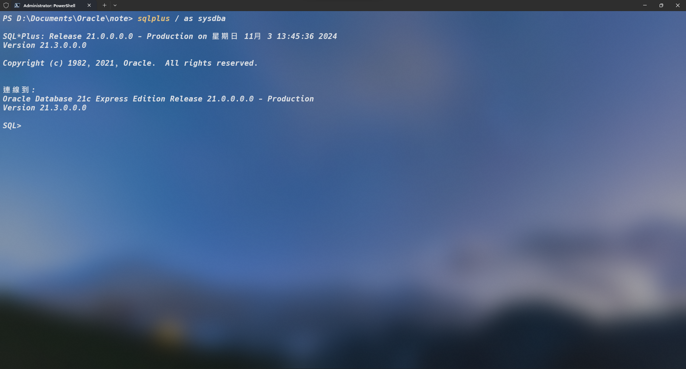
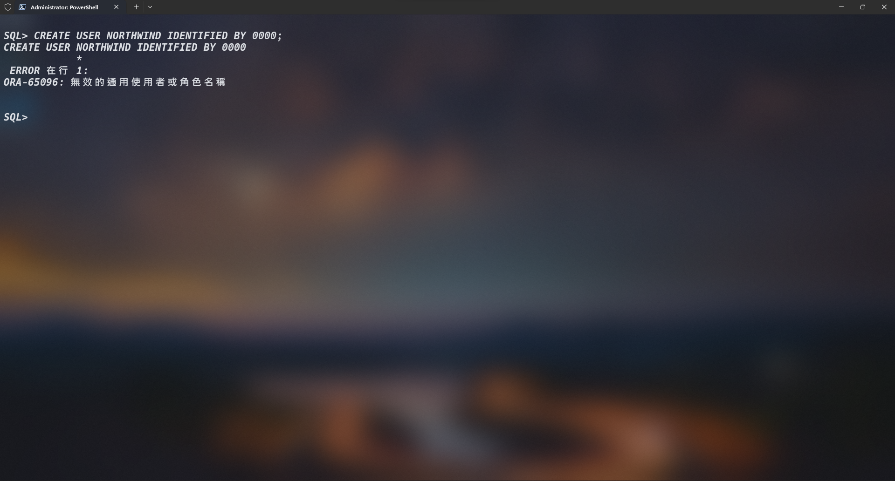
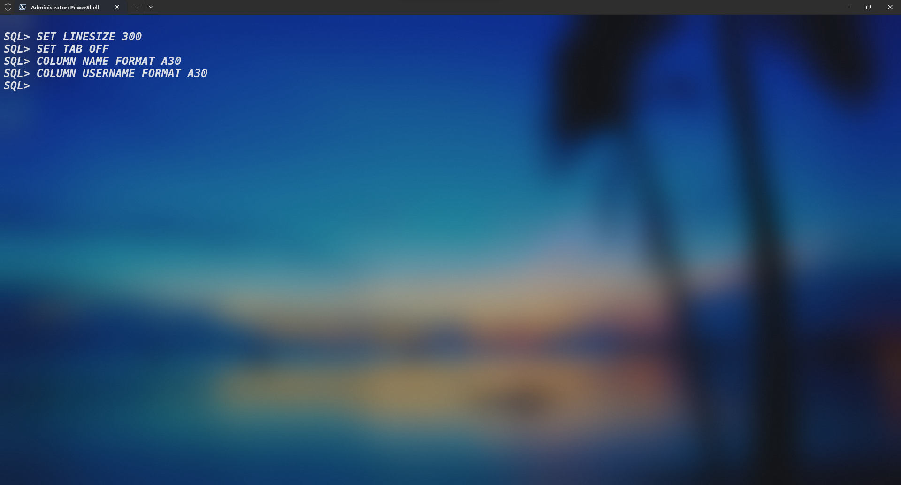
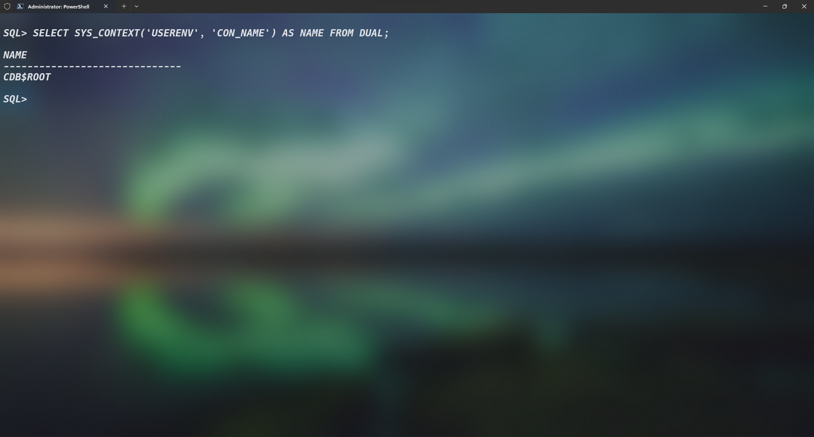
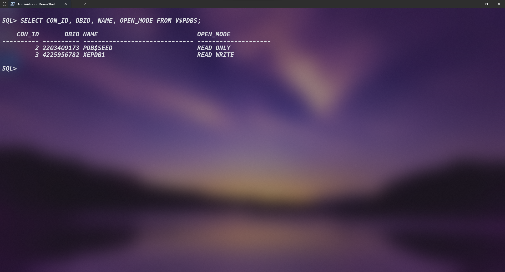
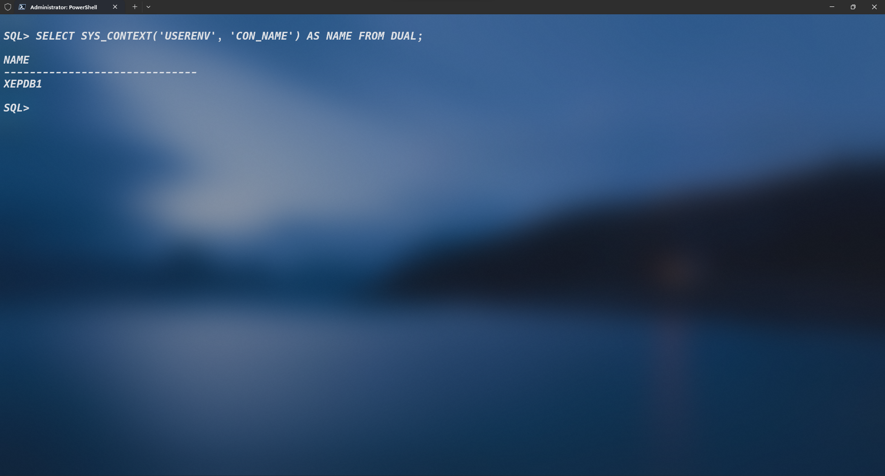
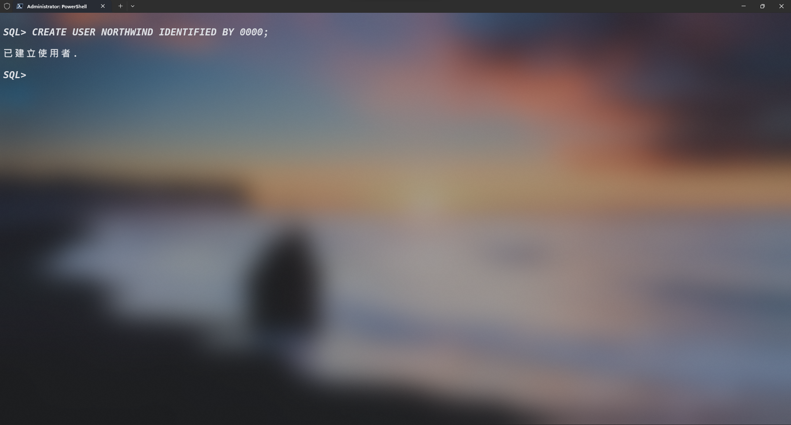
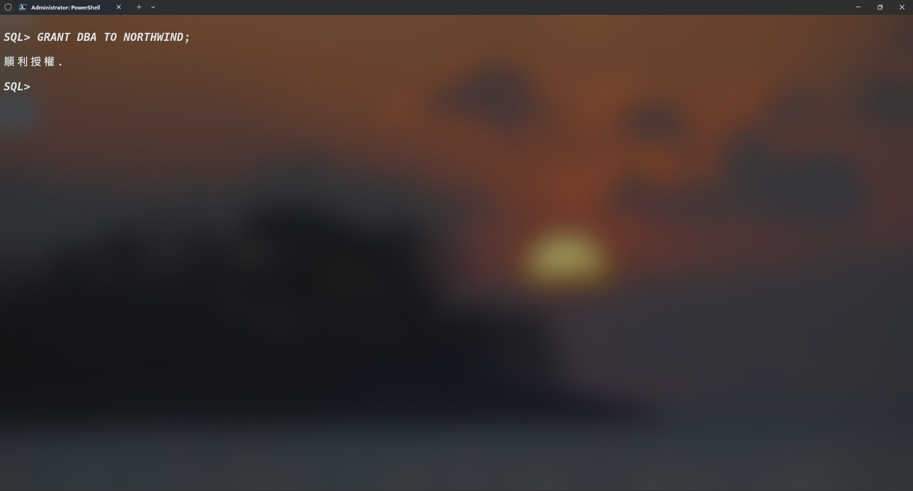

# 使用者(`USER`別名`SCHEMA`)

## 1. 以`SYSDBA`連線至`Oracle 資料庫`



## 2. 嘗試建立`NORTHWIND`使用者

```SQL
CREATE USER NORTHWIND IDENTIFIED BY 0000;
```



## 3. 修改輸出至終端機的格式

輸入以下格式設定讓後續的資料顯示不會錯位導致顯示的資料有問題，若不想對格式作變更亦可不用進行該階段

```SQL
SET LINESIZE 300
```

```SQL
SET TAB OFF
```

```SQL
COLUMN NAME FORMAT A30
```

```SQL
COLUMN USERNAME FORMAT A30
```



## 4. 檢查當前要建立`USER`動作所對應的容器名稱

```SQL
SELECT SYS_CONTEXT('USERENV', 'CON_NAME') AS NAME FROM DUAL;
```



## 5. 查詢容器清單

```SQL
SELECT CON_ID, DBID, NAME, OPEN_MODE FROM V$PDBS;
```



## 6. 更改對應的容器

```SQL
ALTER SESSION SET CONTAINER = XEPDB1;
```


## 7. 確認是否已經修改



## 8. 再次嘗試建立`NORTHWIND`使用者



## 9. 設定比`SYSDBA`次級一點的操控權限

```SQL
GRANT DBA TO NORTHWIND;
```



## **參考文件路徑**

[Oracle 12c 建立使用者時出現“ORA-65096: invalid common user or role name”的錯誤](https://www.cnblogs.com/siyunianhua/p/4004361.html)
