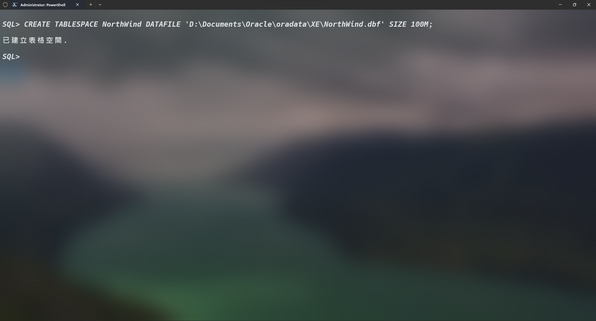
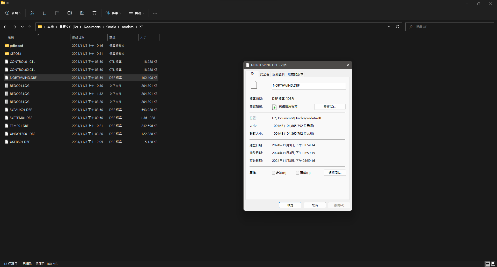
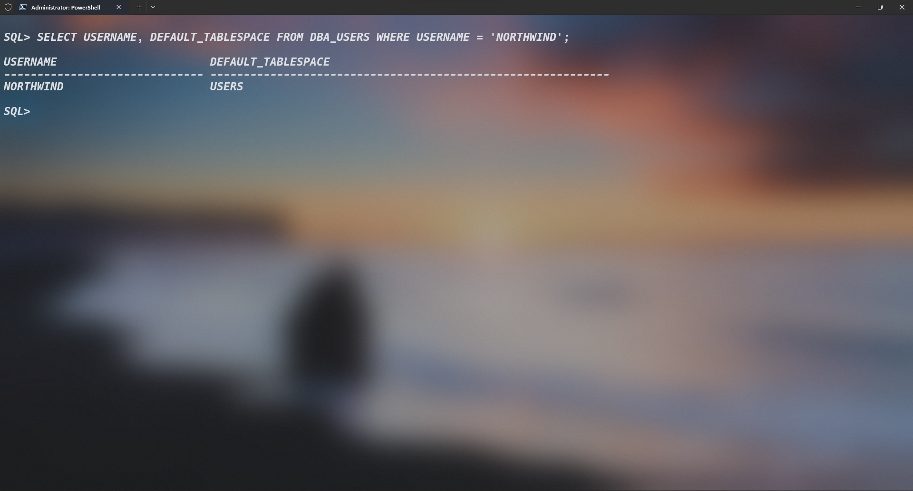
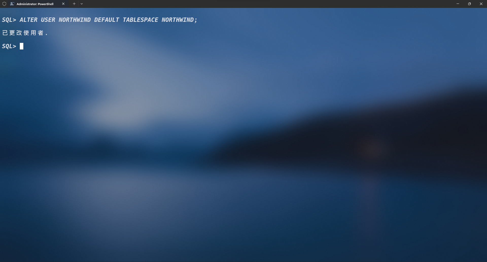
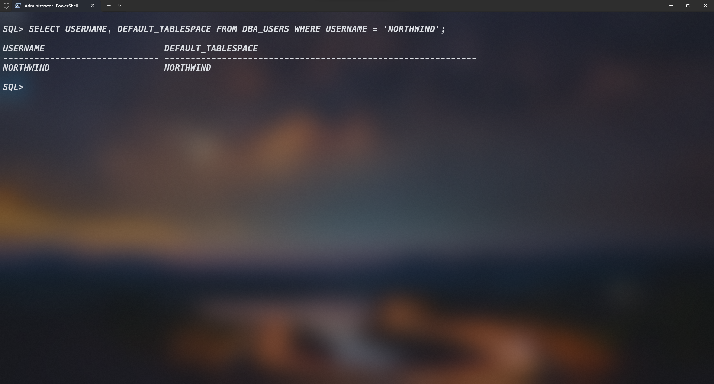

# 表空間(`TABLESPACE`)

建立並區分表空間的用意在於，各`SCHEMA`所操控的數據是獨立且無相關的，可以完整做到保證資料不會有互相影響的問題。

## 1. 建立`TABLESPACE`

```SQL
CREATE TABLESPACE NorthWind DATAFILE 'D:\Documents\Oracle\oradata\XE\NorthWind.dbf' SIZE 100M;
```





## 2. 查詢`SCHEMA`預設對應的`TABLESPACE`

```SQL
SELECT USERNAME, DEFAULT_TABLESPACE FROM DBA_USERS WHERE USERNAME = 'NORTHWIND';
```



## 3. 修改`SCHEMA`所對應的`TABLESPACE`

```SQL
ALTER USER NORTHWIND DEFAULT TABLESPACE NORTHWIND;
```



## 4. 確認`TABLESPACE`有正確修改對應


