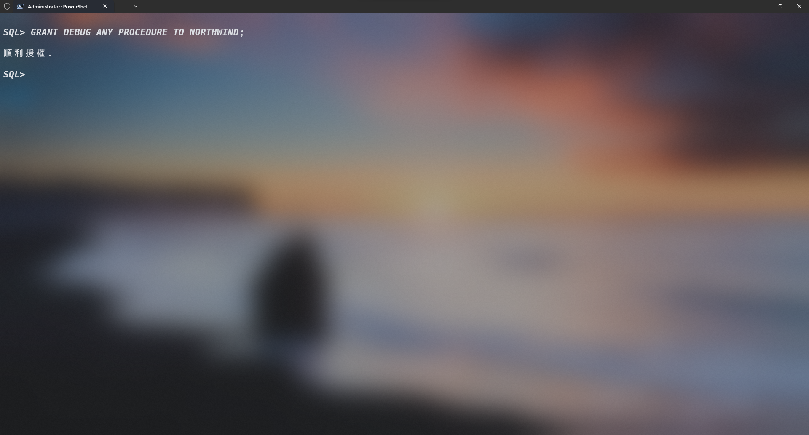

# 測試連線設定與設置偵錯通道

建立完成表空間後可以使用另一個開終端機嘗試以建立的`NORTHWIND`連線。

## 連線測試

### 使用`SQL Plus`測試連線

```batch
sqlplus northwind/0000@localhost:1521/XEPDB1
```


### 使用`Visual Studio Code`測試

&emsp;&emsp;`Visual Studio Code`需要先安裝`Oracle Developer Tools for VS Code (SQL and PLSQL)`套件才可做測試。除了可以做直接的查詢工具之外，也是讓`Visual Studio Code`編寫`PL/SQL`可以做到類似其他語言的`偵錯`功能，也是本教程主要的操作工具。</br>
</br>
安裝方式如以下圖片所示：

### 1.


### 2.


### 3.


### 4.


### 5.


### 6.


### 7.


### 8.


至此資料庫連線資訊測試與建立完成。

## 設置偵錯(`DEBUG`)通道

要與其他程式語言一樣可以有逐行偵錯了解`PL/SQL`其背後的演算過程以下的設定必不可少，若讀者主要使用的是其他資料庫操作工具亦可達到類似的效果，但本教程<u>**主要以`Visual Studio Code`為主**</u>。

### 提升`偵錯連線工作階段`的權限

在未關閉已登入`SYSDBA`的`SQLPlus`鍵入以下指令即可將`NORTHWIND`賦予可`偵錯連線工作階段`的權限。運行結果如下圖。

```SQL
GRANT DEBUG CONNECT SESSION TO NORTHWIND;
```


### 提升`偵錯任何存儲過程`的權限

同樣的在未關閉已登入`SYSDBA`的`SQLPlus`鍵入以下指令即可將`NORTHWIND`賦予可`偵錯任何存儲過程`的權限。運行結果同樣如下圖。

```SQL
GRANT DEBUG ANY PROCEDURE TO NORTHWIND;
```



### 添加網路訪問控制權限的主機

`Oracle`預設是沒有任何接受透過其他工具進行網路訪問控制的權限的主機，因此需要將當前此台的電腦(主機)添加到允許訪問資料庫控制權的清單內(`Oracle`自定義的白名單)，運行結果同樣如下圖。

```SQL
BEGIN
    DBMS_NETWORK_ACL_ADMIN.APPEND_HOST_ACE(
        HOST => '127.0.0.1',
        LOWER_PORT => 65000,
        UPPER_PORT => 65535,
        ACE => XS$ACE_TYPE(
            PRIVILEGE_LIST => XS$NAME_LIST('jdwp'),
            PRINCIPAL_NAME =>'NORTHWIND',
            PRINCIPAL_TYPE => XS_ACL.PTYPE_DB
        )
    );
END;
/

```


至此資料庫的偵錯與測試連線皆設置完畢。
