# 查詢語句

&emsp;&emsp;接續上一章節所定義的類別，分別介紹其主要的功能

## 資料定義語言(`Data Definition Language`簡稱`DDL`)

### CREATE

&emsp;&emsp;主要用於建立資料庫內的資料數據物件，範例`SQL語句`如下：

```SQL
CREATE TABLE DEPARTMENT (
    ID NUMBER(3,0),
    NAME VARCHAR2(100),
    CREATE_TIME DATE
)
```

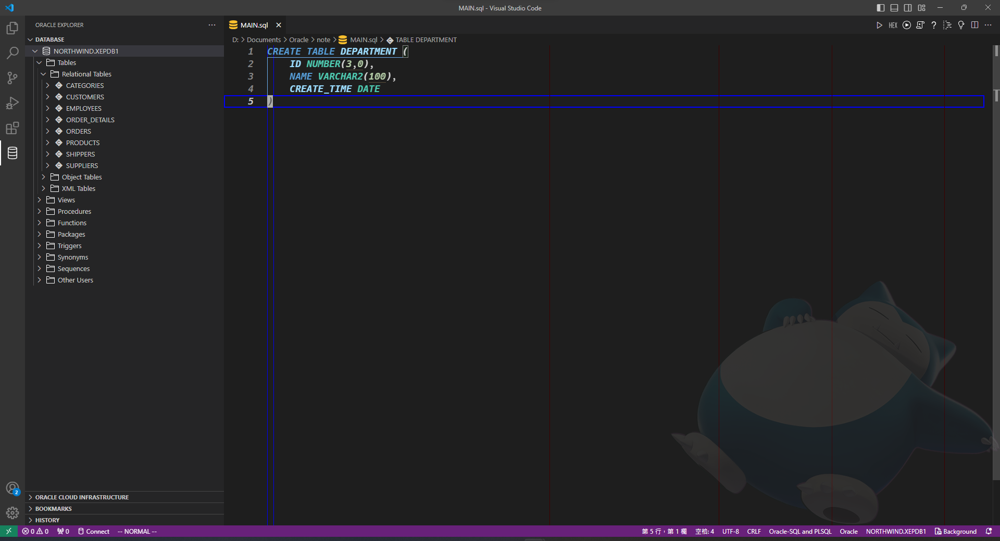

&emsp;&emsp;上述`SQL語句`主要是建立新的`TABLE`最終結果會如下圖：

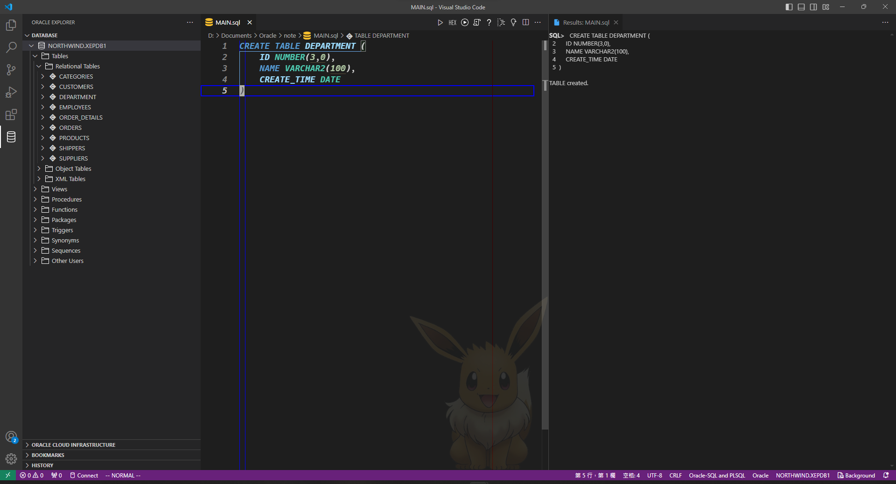

### ALTER

&emsp;&emsp;主要用於修改資料庫內的資料數據物件，範例`SQL語句`如下：

```SQL
ALTER TABLE DEPARTMENT
MODIFY CREATE_TIME DEFAULT SYSDATE;
```

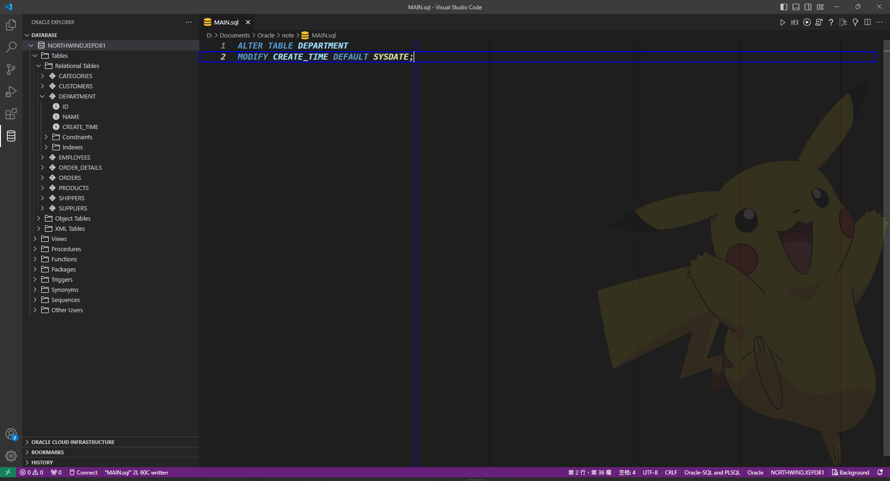

&emsp;&emsp;上述`SQL語句`主要是修改現有`TABLE` `DEPARTMENT`的`CREATE_TIME`預設值為`SYSDATE`，結果如下：

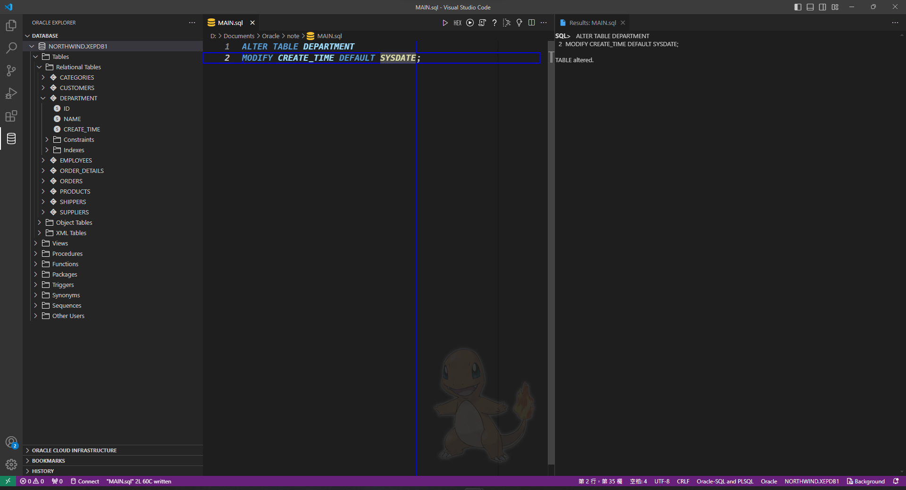

### DROP

&emsp;&emsp;主要用於刪除資料庫內的紀錄資料數據物件，範例`SQL語句`如下：

```SQL
DROP TABLE DEPARTMENT;
```

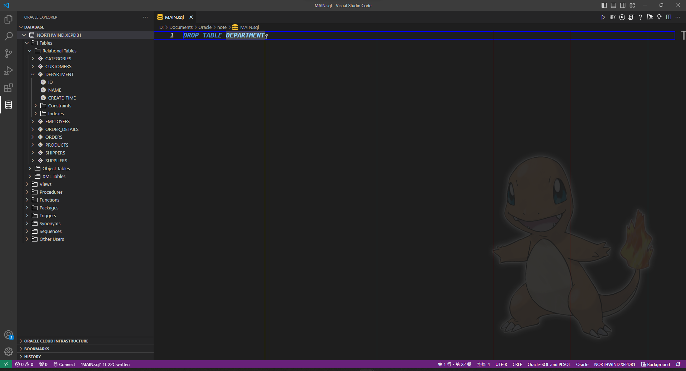

&emsp;&emsp;上述`SQL語句`主要是刪除現有`TABLE` `DEPARTMENT`，結果如下圖：

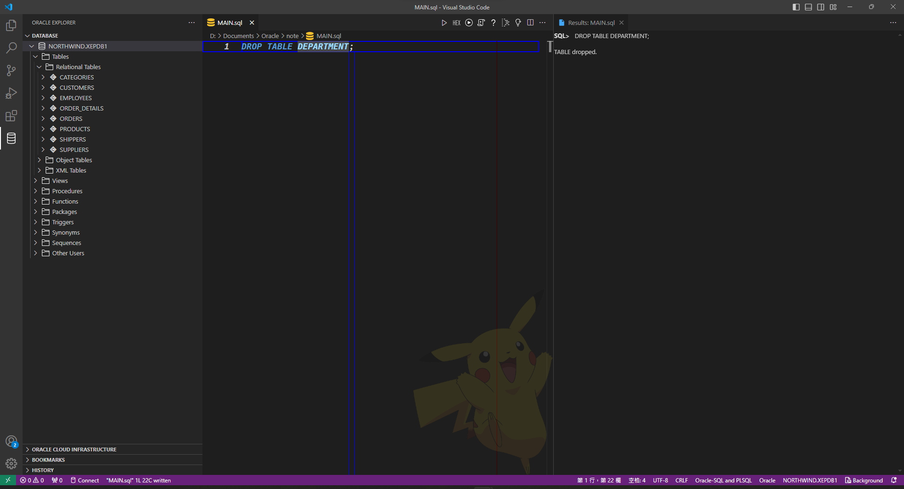

### TRUNCATE

&emsp;&emsp;主要作用於重置資料庫類的紀錄資料數據物件，在執行以下模仿的動作之前，請先建立一個備份數據的動作：

```SQL
CREATE TABLE "NORTHWIND"."SUPPLIERS_BK" (
    "SUPPLIER_ID" NUMBER(9,0) NOT NULL ENABLE,
	"COMPANY_NAME" VARCHAR2(40) NOT NULL ENABLE,
	"CONTACT_NAME" VARCHAR2(30),
	"CONTACT_TITLE" VARCHAR2(30),
	"ADDRESS" VARCHAR2(60),
	"CITY" VARCHAR2(15),
	"REGION" VARCHAR2(15),
	"POSTAL_CODE" VARCHAR2(10),
	"COUNTRY" VARCHAR2(15),
	"PHONE" VARCHAR2(24),
	"FAX" VARCHAR2(24),
	"HOME_PAGE" VARCHAR2(500)
);

INSERT INTO SUPPLIERS_BK
SELECT *
FROM SUPPLIERS;
```

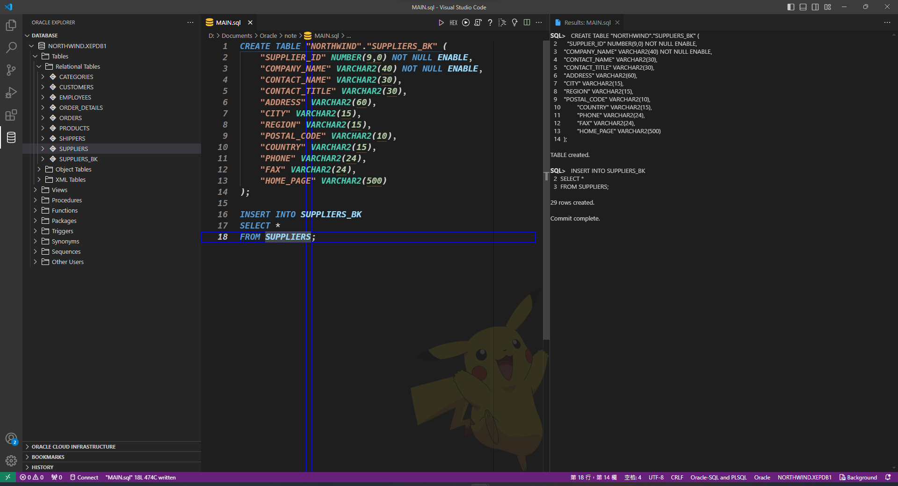

&emsp;&emsp;**該動作主要是可以讓後續的嘗試不會修改到原先的資料，使讀者得已進行嘗試的動作**

&emsp;&emsp;在執行完成上述的動作之後，可以先嘗試顯示建立的備份`TABLE`，如下圖：

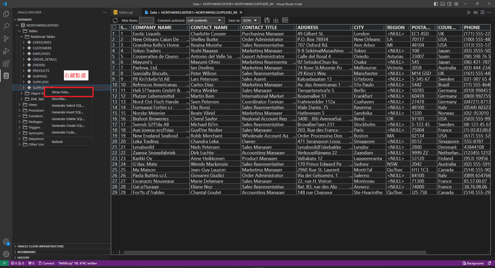

&emsp;&emsp;此時讀者執行以下`SQL語句`時即可不用擔心變更先前的資料：

```SQL
TRUNCATE TABLE SUPPLIERS_BK;
```

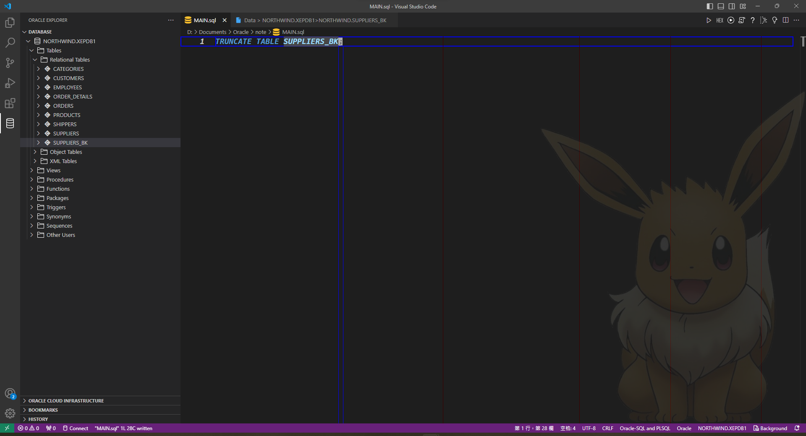

&emsp;&emsp;執行完成後結果如下：

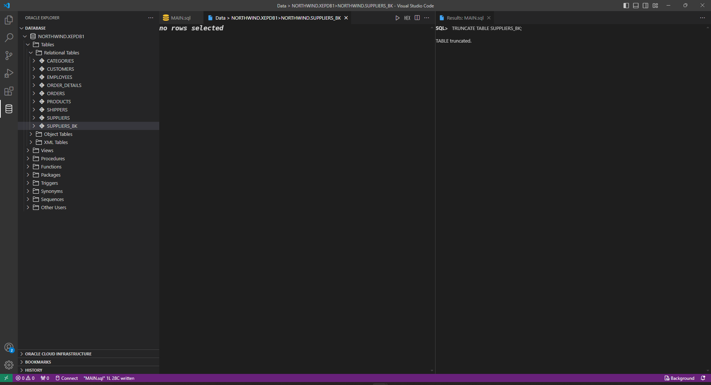

### COMMONT

&emsp;&emsp;主要作用於替`TABLE`或是`COLUMN`添加額外說明，由於`Oracle`有限制各個物件最多`30`個字元，因此可能部分物件名稱不會是完整名稱，此時需要註解來輔助說明，好讓後續接觸的使用者可以了解該`Column`所記錄的數據，範例`SQL語句`如下：

```SQL
COMMENT ON TABLE SUPPLIERS_BK IS 'Temp Table';
```

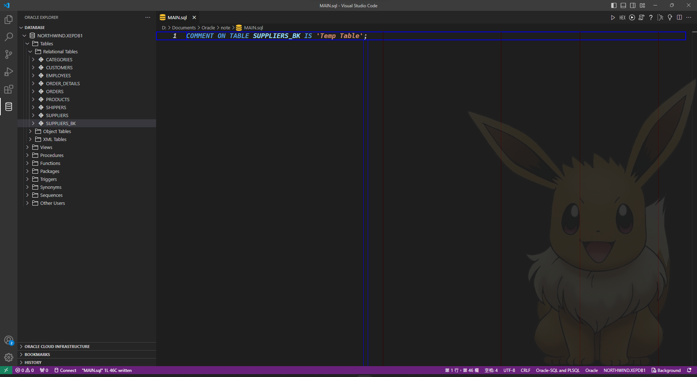

&emsp;&emsp;執行結果如下：

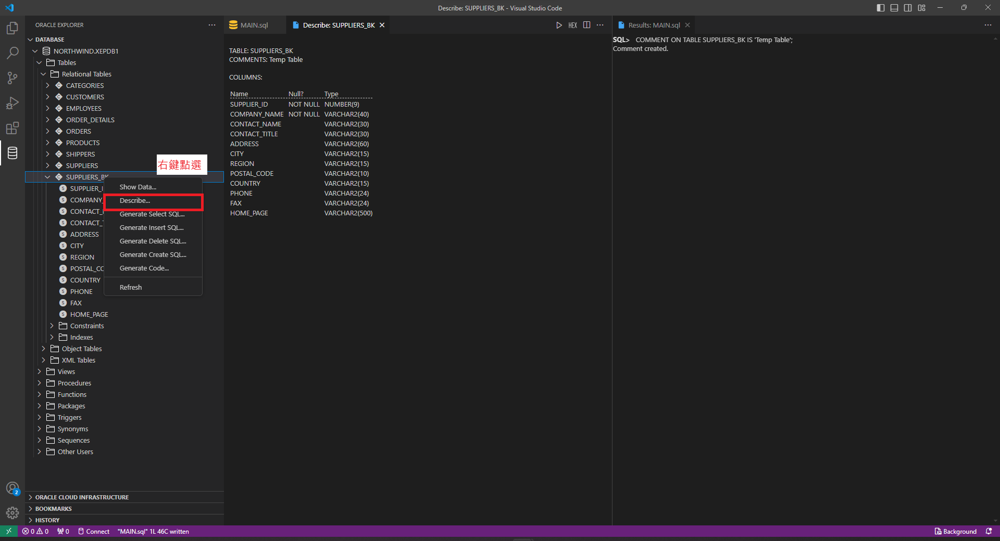

### RENAME

&emsp;&emsp;主要作用為變更名稱，有時候較早時期的名稱對於後來的需求可能會有不敷使用的情況，此時需要重新定義名稱以符合當下的情境，範例`SQL語句`如下 :

```SQL
RENAME SUPPLIERS_BK TO WAIT_FOR_DELETE;
```

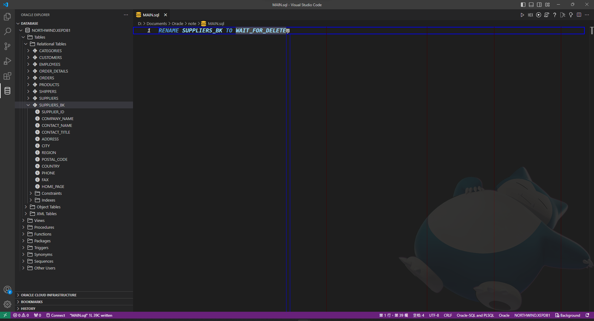

&emsp;&emsp;執行變更名稱後的結果如下：

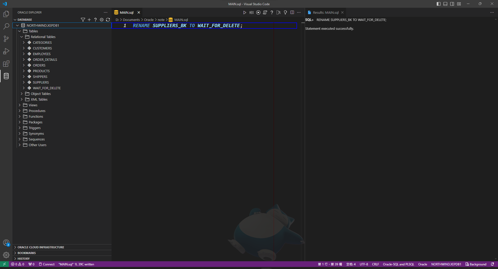
