# 查詢語句

&emsp;&emsp;接續上一章節所定義的類別，分別介紹其主要的功能

## 資料定義語言(`Data Definition Language`簡稱`DDL`)

### CREATE

&emsp;&emsp;主要用於建立資料庫內的資料數據物件，範例`SQL語句`如下：

```SQL
CREATE TABLE DEPARTMENT (
    ID NUMBER(3,0),
    NAME VARCHAR2(100),
    CREATE_TIME DATE
)
```


&emsp;&emsp;上述`SQL語句`主要是建立新的`TABLE`最終結果會如下圖：


### ALTER

&emsp;&emsp;主要用於修改資料庫內的資料數據物件，範例`SQL語句`如下：

```SQL
ALTER TABLE DEPARTMENT
MODIFY CREATE_TIME DEFAULT SYSDATE;
```


&emsp;&emsp;上述`SQL語句`主要是修改現有`TABLE` `DEPARTMENT`的`CREATE_TIME`預設值為`SYSDATE`，結果如下：


### DROP

&emsp;&emsp;主要用於刪除資料庫內的紀錄資料數據物件，範例`SQL語句`如下：

```SQL
DROP TABLE DEPARTMENT;
```


&emsp;&emsp;上述`SQL語句`主要是刪除現有`TABLE` `DEPARTMENT`，結果如下圖：


### TRUNCATE

&emsp;&emsp;主要作用於重置資料庫類的紀錄資料數據物件，在執行以下模仿的動作之前，請先建立一個備份數據的動作：

```SQL
CREATE TABLE "NORTHWIND"."SUPPLIERS_BK" (
    "SUPPLIER_ID" NUMBER(9,0) NOT NULL ENABLE,
	"COMPANY_NAME" VARCHAR2(40) NOT NULL ENABLE,
	"CONTACT_NAME" VARCHAR2(30),
	"CONTACT_TITLE" VARCHAR2(30),
	"ADDRESS" VARCHAR2(60),
	"CITY" VARCHAR2(15),
	"REGION" VARCHAR2(15),
	"POSTAL_CODE" VARCHAR2(10),
	"COUNTRY" VARCHAR2(15),
	"PHONE" VARCHAR2(24),
	"FAX" VARCHAR2(24),
	"HOME_PAGE" VARCHAR2(500)
);

INSERT INTO SUPPLIERS_BK
SELECT *
FROM SUPPLIERS;
```


&emsp;&emsp;**該動作主要是可以讓後續的嘗試不會修改到原先的資料，使讀者得已進行嘗試的動作**

&emsp;&emsp;在執行完成上述的動作之後，可以先嘗試顯示建立的備份`TABLE`，如下圖：


&emsp;&emsp;此時讀者執行以下`SQL語句`時即可不用擔心變更先前的資料：

```SQL
TRUNCATE TABLE SUPPLIERS_BK;
```


&emsp;&emsp;執行完成後結果如下：


### COMMONT

&emsp;&emsp;主要作用於替`TABLE`或是`COLUMN`添加額外說明，由於`Oracle`有限制各個物件最多`30`個字元，因此可能部分物件名稱不會是完整名稱，此時需要註解來輔助說明，好讓後續接觸的使用者可以了解該`Column`所記錄的數據，範例`SQL語句`如下：

```SQL
COMMENT ON TABLE SUPPLIERS_BK IS 'Temp Table';
```


&emsp;&emsp;執行結果如下：


### RENAME

&emsp;&emsp;主要作用為變更名稱，有時候較早時期的名稱對於後來的需求可能會有不敷使用的情況，此時需要重新定義名稱以符合當下的情境，範例`SQL語句`如下 :

```SQL
RENAME SUPPLIERS_BK TO WAIT_FOR_DELETE;
```


&emsp;&emsp;執行變更名稱後的結果如下：


## 資料操作語言(`Data Manipulation Language`簡稱`DML`)

### SELECT

&emsp;&emsp;部分教學可能會把它定義為`資料檢索語言`(`Data Retrieval Language`簡稱`DRL`)或`資料查詢語言`(`Data Query Language`簡稱`DQL`)，主要用於從資料庫的`TABLE`獲取`資訊`或`數據`所在的`Column`，範例`SQL語句`如下：

```SQL
SELECT *
FROM SUPPLIERS;
```

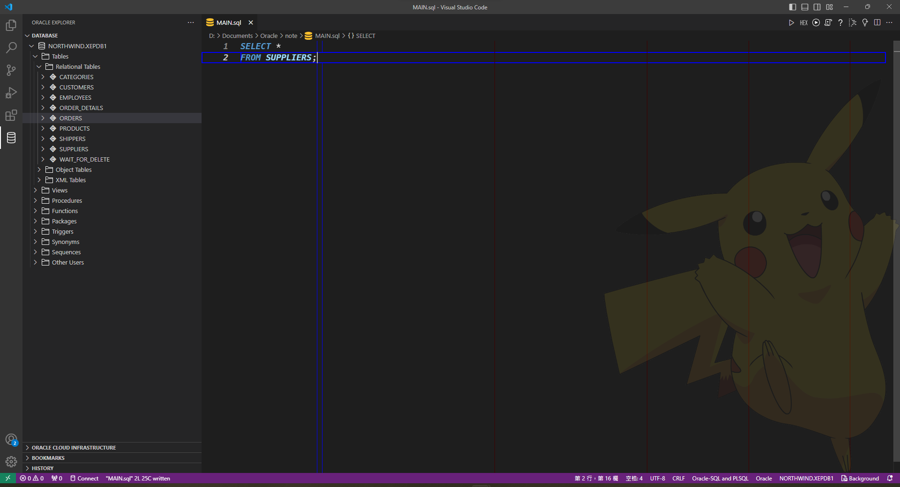

&emsp;&emsp;執行後的結果如下：

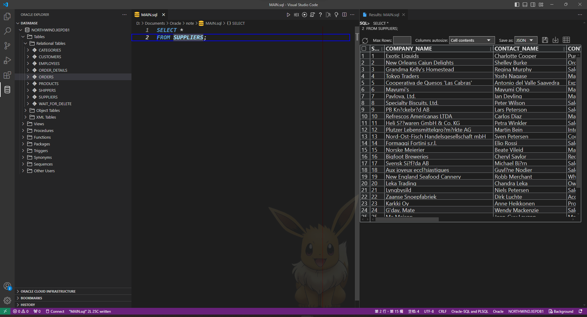

&emsp;&emsp;上述的`*`表示要撈取該`TABLE`的所有`Column`，該方式通常用在大範圍確認數據的方向，倘若讀者使用的情境不需要到全部的`Column`那麼可以指定想要的`Column`，例如：

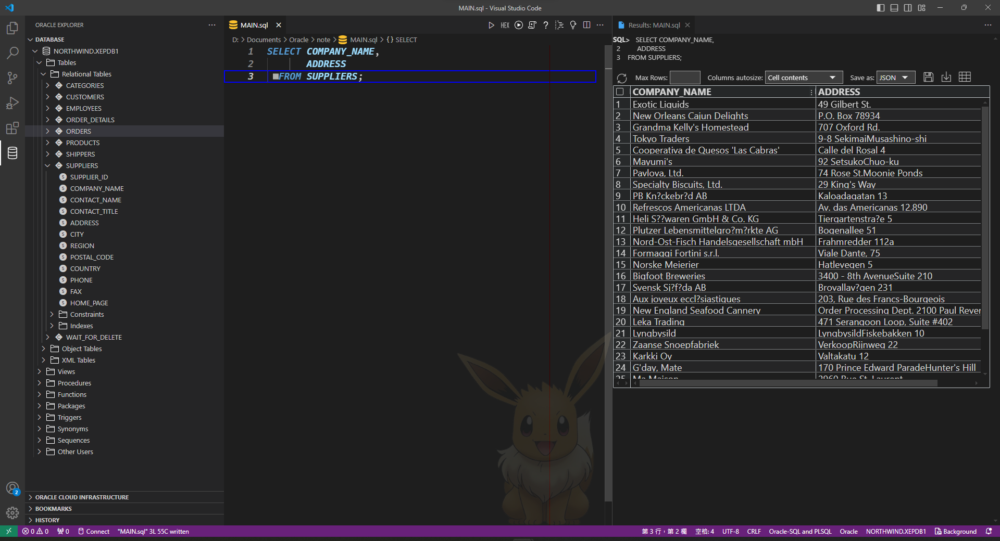

### INSERT

&emsp;&emsp;主要用於將當下要記錄的資料存放進資料庫的`TABLE`內，範例`SQL語句`如下：

```SQL
INSERT INTO EMPLOYEES (
    EMPLOYEE_ID,
    LASTNAME,
    FIRSTNAME,
    TITLE,
    TITLE_OF_COURTESY,
    BIRTHDATE,
    HIREDATE,
    ADDRESS,
    CITY,
    REGION,
    POSTAL_CODE,
    COUNTRY,
    HOME_PHONE,
    EXTENSION,
    PHOTO,
    NOTES,
    REPORTS_TO
) VALUES (
    1,
    'Luke',
    'Lin',
    'Oracle DBA',
    'Sir',
    TO_DATE('1989/09/08','YYYY/MM/DD'),
    SYSDATE,
    '20 State Route 78  United States',
    'Mount Carroll',
    'il',
    '61053',
    'United States',
    '01-2345-6789',
    '5987',
    '',
    '',
    0
  );
```

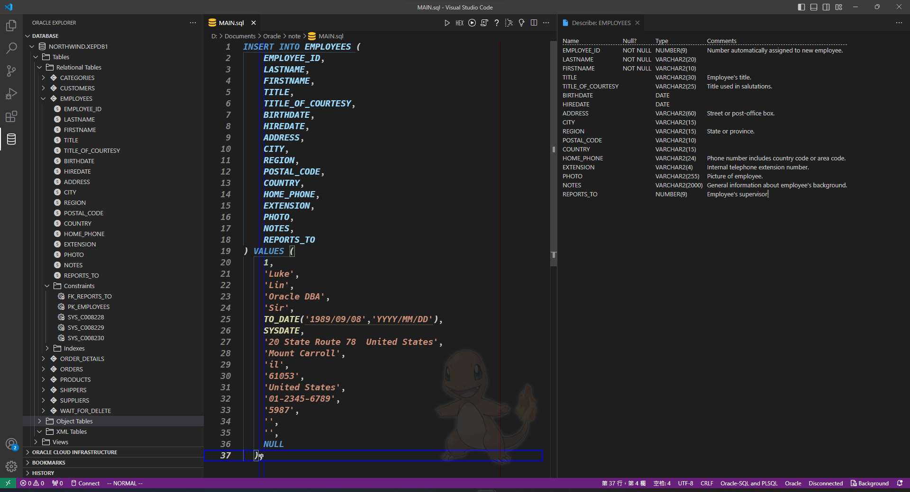

&emsp;&emsp;執行結果如下

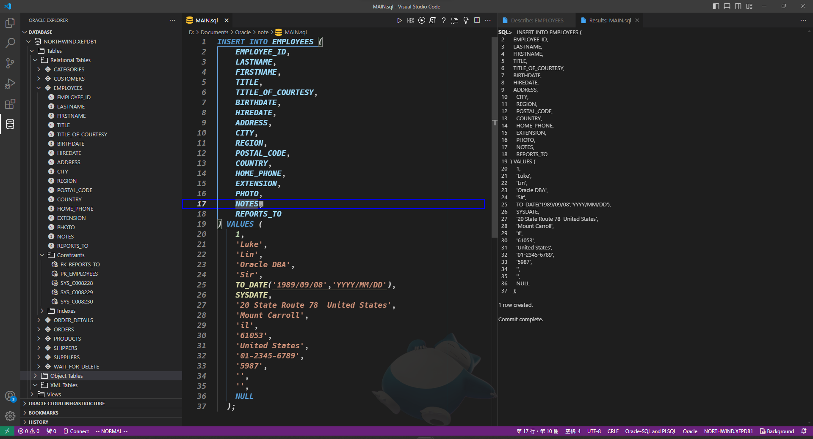

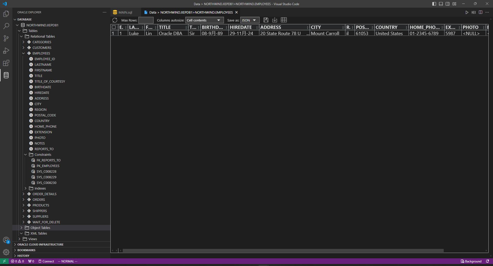

**&emsp;&emsp;`INSERT`不一定要一次針對全部的`Column`都填，可以部份填寫之後再使用`UPDATE`修改。除了`INSERT`之外其他的`DML`皆可使用`WHERE`**

### UPDATE

&emsp;&emsp;主要用於更改`TABLE`的資料，範例`SQL語句`如下：

```SQL
UPDATE EMPLOYEES
   SET TITLE_OF_COURTESY = 'Mr.'
 WHERE EMPLOYEE_ID = 1;
```

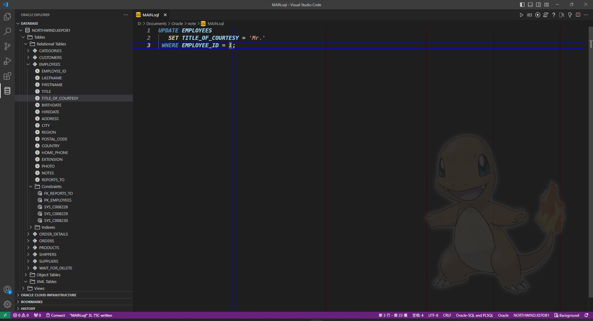

&emsp;&emsp;執行的結果如下：

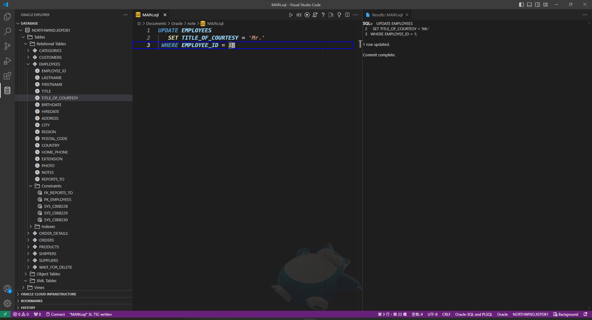

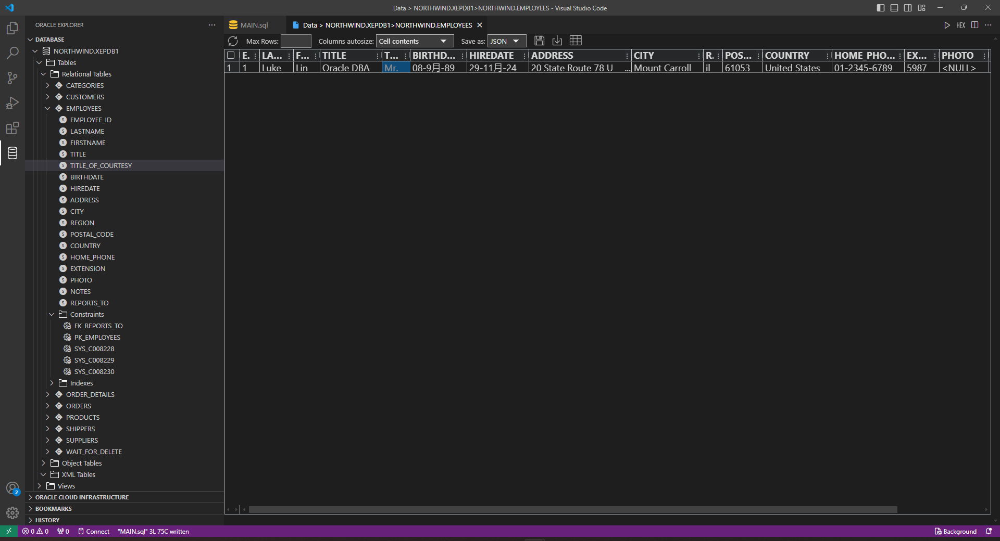

### DELETE

&emsp;&emsp;主要用於刪除儲在`TABLE`的資料，範例``SQL語句`如下：

```SQL
DELETE FROM EMPLOYEES
      WHERE EMPLOYEE_ID = 1;
```

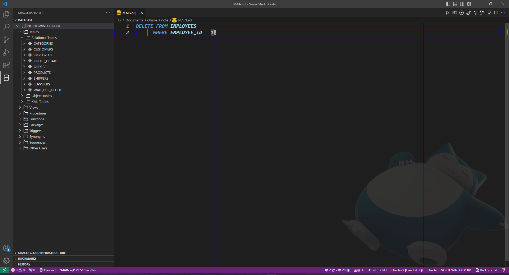

&emsp;&emsp;執行的結果如下：

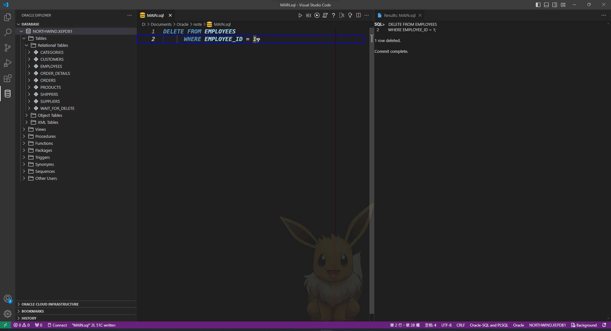

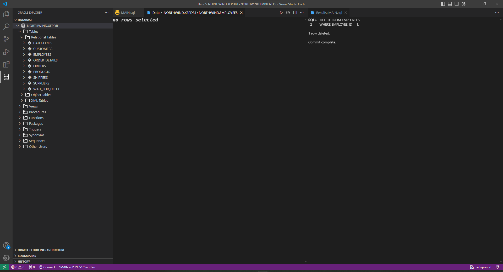

## 資料控制語言(`Data Control Language`簡稱`DCL`)

### GRANT

&emsp;&emsp;主要用於設置當前的用戶對資料庫操控權限的`授予`，比如前面**使用者(`USER`別名`SCHEMA`)的[9. 設定比`SYSDBA`次級一點的操控權限](../2.CreateUser/README.md#69)**

### REVOKE

&emsp;&emsp;主要用於將當前用戶對資料庫操控權的`撤銷`，範例`SQL語句`請參考**Oracle 官方的[REVOKE statement](https://docs.oracle.com/javadb/10.8.1.2/ref/rrefsqljrevoke.html)**
